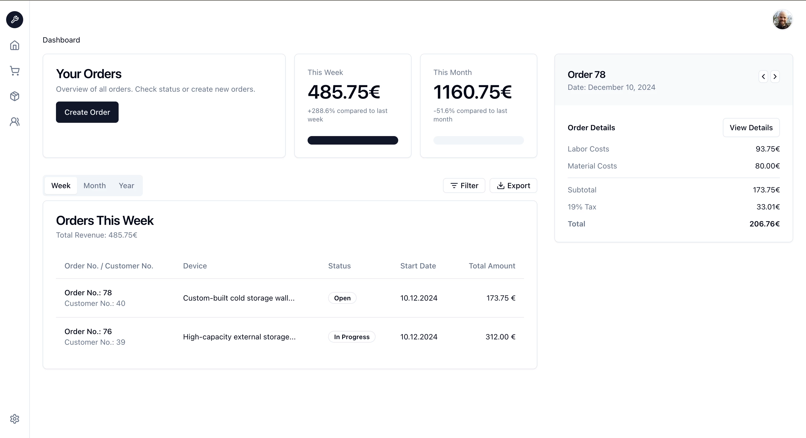

# Easy-Repair Fullstack Project

Easy-Repair ist a fullstack project built with Next.js.

The frontend is built with Next.js, the styling is done with Tailwind CSS and the components are from shadcn/ui.

Hosted on [vercel.com](https://vercel.com/).

Live Preview: [Easy-Repair](https://easy-repair.vercel.app/)



## About the project

Easy-Repair is designed to help repair businesses manage their orders, customers, and inventory efficiently.

## Features

### Order Management

- Create and track repair orders
- Detailed repair status tracking
- Easy cost calculation
- Time tracking
- Customer communication history

### Customer Management

- Customer database
- Contact information

### Product Management

- Product catalog
- Inventory tracking
- Price management

### Dashboard

- Overview of current orders
- Financial metrics
- Weekly and monthly statistics
- Performance tracking

## Technology Stack

### Frontend

- Next.js 14
- React 18
- Tailwind CSS
- shadcn/ui components
- TypeScript

### Backend

- Supabase
- PostgreSQL Database

### Authentication

- GitHub OAuth
- Email/Password authentication

## Getting Started

### Prerequisites

- Node.js 18 or higher
- npm or yarn
- Supabase account

### Installation

1. Clone the repository

   ```
   git clone git@github.com:DayanWalter/easy-repair.git
   ```

2. Install dependencies

   ```
   npm install
   ```

3. Set up environment variables

   ```
   NEXT_PUBLIC_BASE_URL
   NEXT_PUBLIC_SUPABASE_URL
   NEXT_PUBLIC_SUPABASE_ANON_KEY
   NEXT_PUBLIC_AUTH_CALLBACK_URL
   ```

4. Run the development server
   ```
   npm run dev
   ```

## License

This project is licensed under the MIT License - see the LICENSE file for details.

## Contact

- Dayan Walter - [dayanwalter@gmail.com](mailto:dayanwalter@gmail.com)
- Project Link: [https://github.com/DayanWalter/easy-repair](https://github.com/DayanWalter/easy-repair)

## Acknowledgments

- [Next.js](https://nextjs.org/) - React framework
- [Tailwind CSS](https://tailwindcss.com/) - CSS framework
- [shadcn/ui](https://ui.shadcn.com/) - UI components
- [Supabase](https://supabase.com/) - Backend as a Service
